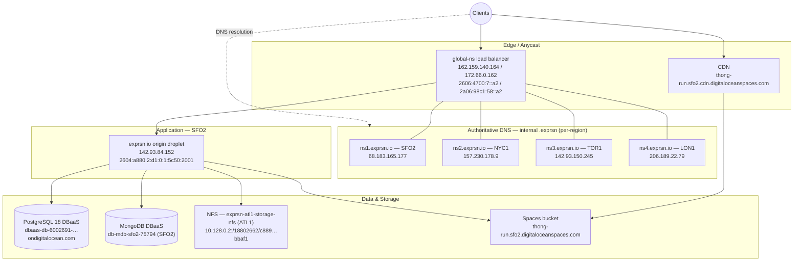

# Exprsn.io Network Topology

> Documented 2026-07-14 from the `exprsn.io` DNS zone export and DigitalOcean infrastructure inventory.
> Serial: `1784047442` · SOA primary: `ns1.digitalocean.com.` · Default TTL: 1800s

## Overview

## Edge / Load balancer (`global-ns`)

The zone apex resolves to the load balancer's anycast IPs, not the origin droplet.

| Record | Type | Value |
|---|---|---|
| `exprsn.io` | A | 162.159.140.164 |
| `exprsn.io` | A | 172.66.0.162 |
| `exprsn.io` | AAAA | 2606:4700:7::a2 |
| `exprsn.io` | AAAA | 2a06:98c1:58::a2 |
| `dns.exprsn.io` | A / AAAA | 162.159.140.164 / 2606:4700:7::a2 (TTL 60) |

## Authoritative nameservers — internal `.exprsn` domain

Four regionally distributed droplets, all pool members of the `global-ns` load balancer. They serve DNS for the **internal `.exprsn` pseudo-TLD**: each hosted Exprsn Network gets an endpoint at `<user>.exprsn` or `<user>.<org>.exprsn`. They are not the public registrar-delegated nameservers for `exprsn.io` (that zone is hosted on DigitalOcean DNS, per the SOA).

| Host | Region | IPv4 | IPv6 |
|---|---|---|---|
| `ns1.exprsn.io` | SFO2 | 68.183.165.177 | 2604:a880:2:d1:0:1:712c:7001 |
| `ns2.exprsn.io` | NYC1 | 157.230.178.9 | 2604:a880:400:d1:0:4:b247:a001 |
| `ns3.exprsn.io` | TOR1 | 142.93.150.245 | 2604:a880:cad:d0:0:1:95f3:f001 |
| `ns4.exprsn.io` | LON1 | 206.189.22.79 | 2a03:b0c0:1:e0:0:1:918e:f001 |

Delegation within the zone: `ns.exprsn.io` NS → `dns.exprsn.io` (which points at the LB anycast IPs).

## Application origin

| Host | Region | IPv4 | IPv6 |
|---|---|---|---|
| `exprsn.io` (origin droplet) | SFO2 | 142.93.84.152 | 2604:a880:2:d1:0:1:5c50:2001 |

Note the origin IP is **not** in DNS — traffic reaches it only through the load balancer.

## Data & storage

| Service | Endpoint | Notes |
|---|---|---|
| PostgreSQL 18 (DBaaS) | `dbaas-db-6002691-do-user-18802662-0.i.db.ondigitalocean.com` | Managed DigitalOcean database |
| MongoDB (DBaaS) | `mongodb+srv://db-mdb-sfo2-75794-f4ede904.mongo.ondigitalocean.com` | SFO2 |
| NFS | `10.128.0.2:/18802662/c889fc7f-e5f9-4f35-9735-33a9f74bbaf1` | Volume `exprsn-atl1-storage-nfs` (ATL1), private network |
| Spaces (S3) | `https://thong-run.sfo2.digitaloceanspaces.com` | Object storage |
| CDN | `https://thong-run.sfo2.cdn.digitaloceanspaces.com` | Fronts the Spaces bucket |

## SRV records

| Service | Prio | Weight | Port | Target |
|---|---|---|---|---|
| `_dns._udp.exprsn.io` | 0 | 0 | 53 | `dns.exprsn.io.` |
| `_http._tcp.exprsn.io` | 0 | 0 | 443 | `exprsn.io.` |
| `_http._tcp.exprsn.io` | 10 | 0 | 80 | `exprsn.io.` |

Clients discover the internal `.exprsn` resolver via `_dns._udp` → `dns.exprsn.io` (the LB anycast IPs, TTL 60), which routes to the nearest of ns1–ns4.

> Note: the SRV targets were originally published with a doubled origin (`exprsn.io.exprsn.io.` — missing trailing dot); corrected 2026-07-14.

## Open items

1. **Origin exposure** — confirm the SFO2 origin droplet (142.93.84.152) firewalls direct :80/:443 access so traffic can't bypass the load balancer.

## Recommendations

Aligned with the MVP scope decisions in `STATUS.md` (single gateway instance, release-engineering-first). Split into what should be settled **before v1.00.00** and what can wait.

### Before v1.00.00

**1. Add managed Redis to the topology — it's missing.**
The platform can't boot without Redis (sessions for auth/ca, Bull queues for timeline/prefetch/moderation/atproto/cortex, prefetch caches on logical DBs 0–2, moderation queue on DB 3), yet the inventory has no Redis endpoint. Provision DO Managed Redis/Valkey in **SFO2, same VPC as the origin**, private hostname only. Logical-DB allocation is already established in code — document it here once provisioned.

**2. Co-locate or replace the ATL1 NFS volume.**
Compute is SFO2; `exprsn-atl1-storage-nfs` is ATL1. NFS is chatty — every metadata op pays the ~55–65 ms SFO↔ATL RTT, and cross-region private routing needs VPC peering to work at all. Either (a) move the NFS volume to SFO2, or (b) preferably point filevault blob storage at the existing SFO2 Spaces bucket (S3 API) and drop NFS from the serving path entirely. Don't ship v1 with filesystem I/O crossing the continent.

**3. Verify Postgres placement and pool sizing.**
Confirm the DBaaS cluster is SFO2 and connect via its **private** VPC hostname (the `.i.db.` name suggests internal — verify). The platform opens a Sequelize pool per module plus one per worker process against one DB; managed PG connection limits are small on entry sizes. Route through the cluster's built-in PgBouncer (transaction mode) and size pools deliberately, or R5 load testing will find the limit for you.

**4. Lock the origin behind the edge.**
The apex IPs (162.159.140.164/172.66.0.162, 2606:4700:7::a2) are proxy/anycast ranges — the origin IP isn't in DNS, but it's still publicly routable. Cloud-firewall the droplet so :80/:443 accept only the edge provider's published ranges, and use authenticated origin pulls (mTLS or an origin cert) so a leaked origin IP is useless. This also closes the loop on R2 (real TLS): terminate a real cert at nginx, enable HSTS.

**5. Decide the `.exprsn` client-resolution story.**
`user.exprsn` / `user.org.exprsn` is a pseudo-TLD: public resolvers will never resolve it, DNSSEC can't sign it, and ICANN name-collision rules mean it could someday be delegated for real. Workable, but only if clients are explicitly pointed at ns1–ns4 (app-embedded resolver, DoH endpoint on `dns.exprsn.io`, or OS-level config). Recommend: keep `.exprsn` for in-network/app resolution, but mirror every tenant endpoint under a registered name (e.g. `<user>.x.exprsn.io`) so browsers and third-party clients have a path that just works. Decide before v1 — it shapes tenant URLs, TLS issuance (no public CA will issue for `.exprsn`; use the in-house Exprsn CA there), and marketing copy.

**6. Give the NS fleet a replication topology.**
Four regional nameservers need a defined zone-distribution mechanism: a hidden primary (can be the origin or a small droplet) pushing AXFR/IXFR with TSIG to ns1–ns4, with NOTIFY on tenant provisioning — tenant creation is presumably dynamic, so measure propagation SLA (a new `user.exprsn` should resolve within seconds, not a cron cycle). Add per-NS health checks at the LB so a dead region drops out of the anycast pool.

**7. Ship backups off-host.**
R6 tooling exists locally; wire the nightly `pg_dump` cron to push to a **versioned, separate** Spaces bucket (not `thong-run`, and ideally a different region than the DB). DBaaS PITR covers the managed PG; the dump is your provider-independent copy. Snapshot the NFS volume (or rely on Spaces versioning if rec #2b is taken).

### Post-v1 (document now, build later)

**8. Origin HA.** Single SFO2 droplet is the accepted MVP SPOF. Before scaling out, the code prerequisites are already ticketed: gateway ownership of the Socket.IO redis-adapter (STATUS #3) and the lowcode scheduler's single-instance assumption. Cheap interim step: automated droplet snapshots + a reserved IP so rebuild is minutes, not hours.

**9. Split workers from the gateway droplet.** `worker:timeline`, `worker:prefetch`, `worker:atproto`, `worker:cortex` can saturate CPU (moderation AI calls, fan-out) independent of request traffic. Fine on the same droplet under a supervisor at MVP; first scale move is a dedicated worker droplet — no code change needed, they only need DB+Redis.

**10. Clarify MongoDB's role.** The consolidated platform is Sequelize/Postgres-only; nothing in `services/` reads the DO MongoDB cluster. If it serves a legacy/external system, note it; if not, decommission it — it's cost and attack surface with no consumer.

**11. Brand the CDN hostname.** `thong-run.sfo2.cdn.digitaloceanspaces.com` will appear in user-visible asset URLs. Map a custom subdomain (`cdn.exprsn.io`) onto the Spaces CDN endpoint with a managed cert.

**12. Regional expansion path.** The NS fleet already spans SFO2/NYC1/TOR1/LON1 but all application traffic terminates in SFO2. When latency matters, the order is: CDN for static/media (already in place) → regional read replicas → regional gateways (blocked on #8's prerequisites). Don't distribute the primary Postgres before there's a demonstrated need.
